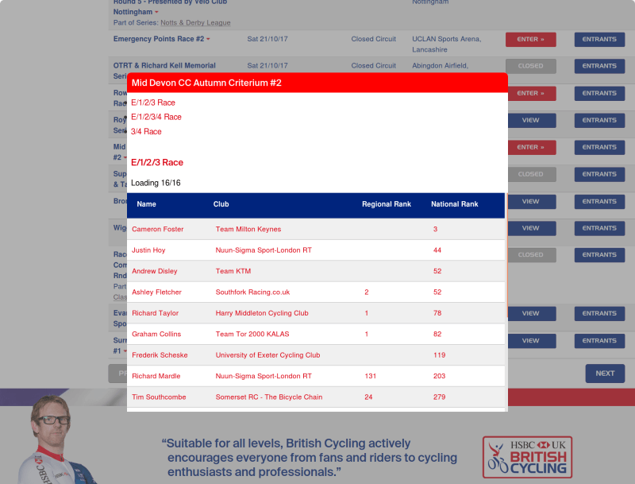

# ⚙ race-ext-react

The orginal race-ext was build using an early beta of [glimmerjs](https://glimmerjs.com/). This is a spike in [reactjs](https://reactjs.org).

Web Extension to retrieve britishcycling.org.uk/events entrants ordered by regional and national rankings

[Firefox addon](https://addons.mozilla.org/en-US/firefox/addon/know-the-competition/)

[Chrome addon](https://chrome.google.com/webstore/detail/know-the-competition/odlnobeiombjhcehmhonbiijfeodcoae)



## Prerequisites

This project was bootstrapped with [Create React App](https://github.com/facebook/create-react-app).

You will need the following things properly installed on your computer.

- [Git](https://git-scm.com/)
- [Node.js](https://nodejs.org/) (with NPM)
- [Yarn](https://yarnpkg.com/en/)

## Installation

- `git clone git@github.com:mrloop/race-ext-react.git` this repository
- `cd race-ext`
- `yarn`

## Running / Development

- `yarn start:firefox`

### Building

- `yarn build`

### Testing

- `yarn test`

### Deploy

Build for firefox ext

```
yarn build:ext
```

Build for chrome ext

```
yarn build:ext
```

- [Firefox](https://addons.mozilla.org/en-GB/developers/addon/submit/upload-listed)
- [Chrome](https://chrome.google.com/webstore/developer/update?authuser=1)
- [Edge](http://docs.microsoft.com/en-us/microsoft-edge/extensions/getting-started#publishing-to-the-windows-store)

## Further Reading / Useful Links

- [MDN WebExtensions](https://developer.mozilla.org/en-US/Add-ons/WebExtensions)
- [Microsoft WebExtensions](https://docs.microsoft.com/en-us/microsoft-edge/extensions/getting-started)
- [British Cycling](https://www.britishcycling.org.uk/events?search_type=upcoming)
- [reactjs](https://reactjs.org/docs/getting-started.html)
